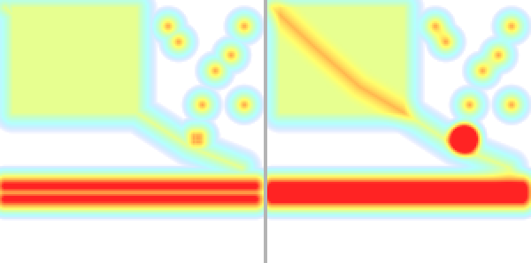
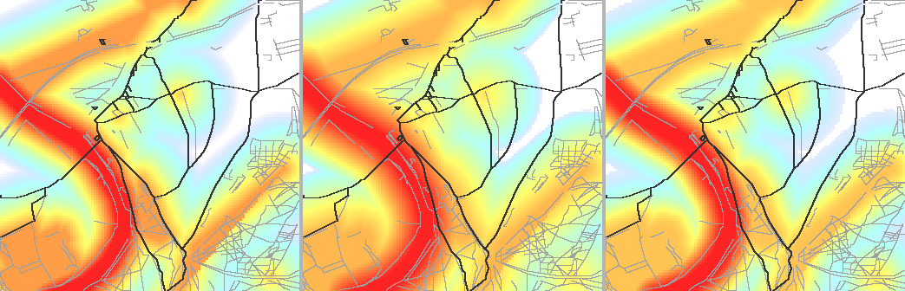
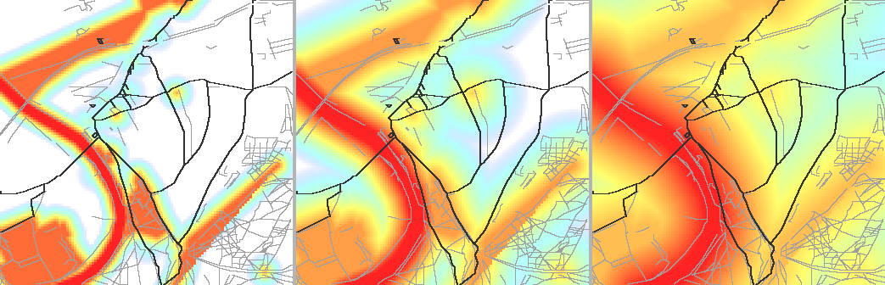
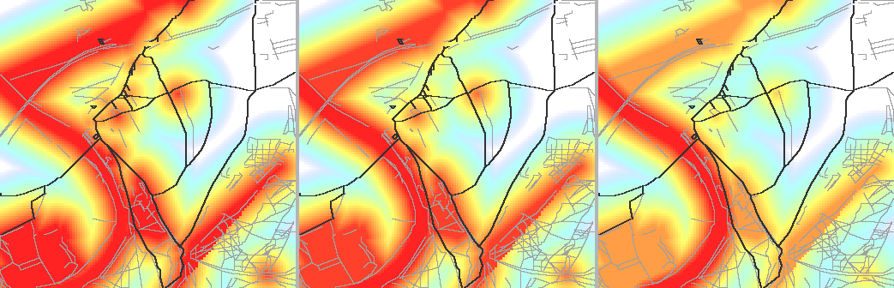
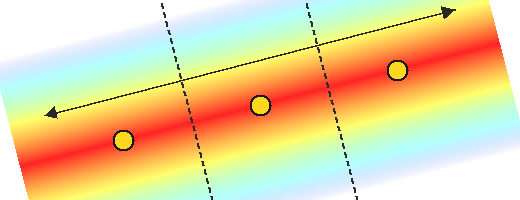

# Scenic Routing Algorithm

Pedestrian routing along parks, rivers, and other points of interest using a POI heat map as an edge cost signal in Valhalla's routing graph.

---

## Contents

1. [Routing Approaches](#1-routing-approaches)
2. [Scenic Routing in Valhalla](#2-scenic-routing-in-valhalla-custom-scenic_pedestrian)
3. [Heat Map Construction](#3-heat-map-construction)
4. [Peaks and Route Extension](#4-peaks-and-route-extension)

---

## 1. Routing Approaches

Four approaches in increasing order of complexity.

### 1.1 Plain Shortest Path

Standard Dijkstra / A\* minimising edge cost with no awareness of surroundings.

```
Start ──────────────────────── End
         (shortest path)
```

**Pros:** fast, reliable.  
**Cons:** routes follow busy roads, ignoring riverside paths and parks.

### 1.2 Intermediate Waypoints

Idea: select a set of scenic features, build a graph over them, find the best path through the graph, then re-route through the chosen nodes via Valhalla to get a real road route.

```
Start ──→ wp1 ──→ wp2 ──→ wp3 ──→ End
          (park  (river  (park
          edge)  bank)   edge)
```

The full pipeline:

1. **Feature query** — query features within a search corridor around the A→B line: vector similarity, tag filters, fuzzy name search.
2. **Clustering** — group nearby features; each cluster becomes a candidate node.
3. **Graph construction** — build a graph over the candidate nodes; edges represent travel between them.
4. **Edge weighting** — use Valhalla's time/distance matrix to weight edges with real pedestrian travel times.
5. **Graph pruning** — reduce to a sparse graph (e.g. k-nearest-neighbours) to keep routing tractable.
6. **Path selection** — find the route through the graph that maximises scenic coverage within the detour budget.
7. **Road re-routing** — pass the selected nodes as forced waypoints to Valhalla to obtain a real on-road route.

**Pros:** route is guaranteed to pass through specific chosen features; works well when the goal is to visit a discrete set of POI.  
**Cons:**
- Many Valhalla calls needed for edge weighting (one matrix call covers many pairs, but the graph can still be large).
- Clustering and graph topology add significant implementation complexity.
- Path selection in a weighted graph with a budget constraint is NP-hard in general; heuristics are required.
- Works best for discrete POI (museums, landmarks); less natural for continuous scenic corridors like a riverbank or a park edge.

### 1.3 Heat Map

Idea: build a continuous heat map over POI in the search area and feed it to Valhalla as an edge cost signal. Edges near high-heat zones cost less, so the router naturally gravitates toward scenic features without explicit waypoints.

Compute heatmap over all POI in the bbox and feed it to Valhalla as `scenic_pedestrian`.  
The router finds the cheapest path where edges near high-heat zones cost less.

**Pros:** POI-query semantics are fully captured; single Valhalla call.  
**Cons:** if the hot zone lies off any pedestrian path within the cutoff radius, the router ignores it — the discount changes edge costs but not graph topology.

### 1.4 Current: Combined Approach

Heat map + route quality score + explicit peak waypoints when needed.

```
                ┌─ heatmap.Compute(POI, bbox) ───────────────┐
                │                                            │
Plan() ─→ baseRoute  ─→  val.RouteScenic(heatmap) ─→ scoreRoute()
                                   │
                          score ≥ routeHeatThreshold?
                          ┌── YES → return scenic route
                          └── NO  → heatGrid.Peaks(10) → TSP → RouteScenic(peaks + heatmap)
```

Full flow:

1. **Baseline** — plain `pedestrian` A→B for bbox computation, speed estimate, and length comparison.
2. **Heat map** — `heatmap.Compute(features, bbox)` builds a 50 m/cell grid.
3. **Scenic route** — `RouteScenic` with the heat map and no explicit waypoints.
4. **Quality score** — `ScoreRoute`: average normalised heat along the route sampled every 50 m.
5. **Peaks** — if `score < routeHeatThreshold`, compute `heatGrid.Peaks(10)` and route through the subset with maximum total heat (TSP bitmask DP).
6. **Iterations** — try [3, 6, 10] peaks; stop when `score ≥ routeHeatThreshold` or peaks exhausted.

---

## 2. Scenic Routing in Valhalla: Custom `scenic_pedestrian`

### 2.1 Why a Custom Costing

Valhalla has no built-in support for per-request raster edge weights.  
Workarounds include: modifying tiles on the fly, an external scoring service, or a custom costing.  
Custom costing was chosen — it requires no tile storage changes and works in a single HTTP request.

### 2.2 Patch Structure

Patch: `infra/valhalla-base/patches/scenic_pedestrian.patch`

| File | Change |
|------|--------|
| `proto/descriptors/options.proto` | new type `Costing::scenic_pedestrian = 13` |
| `src/proto_conversions.cc` | string name `"scenic_pedestrian"` |
| `src/sif/pedestriancost.cc` | `ScenicPedestrianCost` class + `ParseScenicPedestrianCostOptions` |
| `valhalla/sif/scenic_pedestriancost.h` | declarations |
| `valhalla/sif/costfactory.h` | register `CreateScenicPedestrianCost` |
| `valhalla/sif/dynamiccost.h` | map type to itself (not expanded into sub-costs) |
| `src/thor/worker.cc` | max distance for the new type (7200 s, same as pedestrian) |
| `src/sif/dynamiccost.cc` | dispatch in `ParseCosting` |

### 2.3 Passing the Heat Map Between Loki and Thor

Valhalla's pipeline: **Loki** (parses the request) → **Thor** (runs A\*).  
They run in separate threads and communicate via a protobuf-serialised `Costing`.

**Problem:** the heat map is a large byte array; `Costing` has no field for it.  
**Solution:** pack everything into `Costing.name` using ASCII unit-separator `\x1F` (never appears in base64):

```
"scenic_pedestrian\x1F<base64_data>\x1F<min_lat>\x1F<min_lon>\x1F<max_lat>\x1F<max_lon>\x1F<width>\x1F<height>\x1F<weight>"
```

`ParseScenicPedestrianCostOptions` (Loki) packs.  
`ScenicPedestrianCost::loadFromName` (Thor) unpacks.

### 2.4 Edge Cost Discount Formula

```cpp
Cost EdgeCost(...) {
    Cost base = PedestrianCost::EdgeCost(...);   // standard pedestrian cost

    // Sample the heat map at every shape point of the edge, take the mean.
    float h = 0.0f;
    for (const auto& ll : edgeinfo.shape()) {
        h += sampleHeatmap(ll.lat(), ll.lng());
    }
    h /= n;  // mean ∈ [0, 1]

    float factor = std::max(0.1f, 1.0f - scenic_weight_ * h);
    return Cost{ base.cost * factor, base.secs };  // secs unchanged
}
```

**Key:** `secs` (actual walking time) is untouched — only `cost` (the A\* virtual cost) is modified.  
With `scenic_weight = 1.0` and `h = 1.0` the edge costs 10× less (`factor = 0.1`).

```
heat:   0.00   0.25   0.50   0.75   1.00
factor: 1.00   0.75   0.50   0.25   0.10
```

### 2.5 Heat Map Sampling

```cpp
float sampleHeatmap(double lat, double lon) {
    int x = (lon - min_lon_) / (max_lon_ - min_lon_) * width_;
    int y = (max_lat_ - lat) / (max_lat_ - min_lat_) * height_;
    return heatmap_[y * width_ + x] / 255.0f;  // uint8 → [0, 1]
}
```

Nearest-neighbour (no interpolation) — sufficient for 50 m grid cells and edge shape point spacing of ~10–20 m.

---

## 3. Heat Map Construction

### 3.1 Typical Heat Map Dimensions

| Parameter | Value |
|-----------|-------|
| Cell size | 50 m |
| BBox buffer | 1500 m on each side |
| 8 km route, Δlat≈5 km, Δlon≈8 km | grid ≈ 220 × 140 cells |
| uint8 byte size | ~31 KB |
| After base64 | ~41 KB in JSON |

### 3.2 Input Data

Each `Feature` has:
- `Similarity float64` — relevance score ∈ [0, 1] (cosine, tag, name, or combined)
- `Geom []byte` — GeoJSON geometry from PostGIS (Point / LineString / Polygon / Multi…)

### 3.3 Kernel Formula

```
heat(cell) = max_i( sim_i^4 × (1 − d_i / cutoff)² )
```

| Component | Meaning |
|-----------|---------|
| `sim_i^4` | feature weight; sharpens contrast — sim=0.9 → w=0.66, sim=0.5 → w=0.06 |
| `(1 − d/cutoff)²` | quadratic spline; 1 at d=0, 0 at d=cutoff |
| `cutoff = 3σ = 450 m` | with σ=150 m |
| `max` | the nearest significant feature wins; dense clusters do not accumulate |

Grid initialised to `−∞` (log-sum-exp identity), updated via `math.Max`.

### 3.4 Geometry Distance

Distance `d` to the **nearest point** on the geometry (`distM` method on each geometry type):

| Type | d |
|------|---|
| `Point` | Euclidean to the point |
| `LineString` | minimum over segments (projection onto segment) |
| `Polygon` | 0 if inside the ring (ray casting), otherwise to the boundary |
| `MultiPolygon` | minimum over parts |
| `GeometryCollection` | minimum over components |

σ is the same for all geometry types — equal relevance means equal influence radius regardless of object size.

> **Why not σ = f(area)?** With σ proportional to size, a small pond (high sim) would heat the same area as a small square, while a large park like Hyde Park would dominate half the map. A fixed σ=150 m gives an intuitive "pedestrian reach radius".

### 3.5 Kernel Formula Comparison

The images below are generated by `docs/gen/kernel_compare_test.go`. The aggregation comparison uses a synthetic scene; the kernel shape and zone-of-influence comparisons use real OSM geometries (Richmond / Kew, London). © OpenStreetMap contributors, [ODbL](https://www.openstreetmap.org/copyright).

#### Aggregation: max vs sum

Scene: a river (LineString, sim=0.80) plus a **tight cluster** of 9 points within a ~250 m radius (sim=0.65 each) and 6 **sparse** points of the same sim spaced 2 km+ apart.

Left: **max** (current). Right: **sum**.



With **max**, every cell is won by the single best nearby feature. The tight cluster and each sparse point all peak at 0.65⁴ ≈ 0.18 — they look identical.

With **sum**, contributions from all 9 overlapping cluster points accumulate at the cluster centre to ~1.4, exceeding the river's 0.80⁴ ≈ 0.41 and becoming the image ceiling. The cluster turns into the dominant red hot-spot; sparse points stay small.

This is the core failure mode of sum aggregation: a dense group of medium-quality urban POI (cafés, benches, bollards) outcompetes a high-quality scenic feature by sheer quantity. **max** avoids this — density does not inflate the score.

#### Kernel Shape: quadratic vs linear vs gaussian

Scene: Richmond / Thames area — Thames centreline (OSM way 26456375, sim=0.95), parks (sim=0.80), viewpoints (sim=0.75), cafés/pubs (sim=0.55). Major roads overlaid in dark grey; footpaths in light grey. σ=150 m (production default), max aggregation, per-variant ceiling.
© OpenStreetMap contributors, [ODbL](https://www.openstreetmap.org/copyright).

Left: **quadratic** (current). Middle: **linear**. Right: **gaussian**.



At d = ½ × cutoff = 225 m from the feature edge:
- **linear**: 1 − 0.5 = 0.50 → widest halo, most gradual fade to white
- **gaussian**: exp(−(1.5)²/2) ≈ 0.32 → moderate
- **quadratic**: (1 − 0.5)² = 0.25 → narrowest, sharpest edge

Looking at the right cold (white) area where residential streets sit far from the river and parks: with linear, those streets gain more residual warmth from distant features; with quadratic the transition to cold is sharper. The difference is subtle at σ=150 m — it becomes more pronounced at larger σ.

Quadratic was chosen over linear because a wider halo biases the router toward every cell within 450 m equally, losing spatial focus. Quadratic concentrates the pull closer to the feature. Gaussian requires the same hard cutoff at 3σ with no practical advantage.

#### Zone of Influence: σ=50 m vs σ=150 m vs σ=400 m

Same Richmond / Thames scene, quadratic kernel, max aggregation, per-variant ceiling. Roads and footpaths overlaid to show which streets fall inside vs outside the warm zone.
© OpenStreetMap contributors, [ODbL](https://www.openstreetmap.org/copyright).

Left: **σ=50 m** (cutoff 150 m). Middle: **σ=150 m** (production default, cutoff 450 m). Right: **σ=400 m** (cutoff 1200 m).



- **σ=50 m**: almost no influence beyond the feature boundary. The Thames is a narrow red ribbon; the park polygon has a near-hard edge; streets 100 m from the river are already cold (white). Only the Thames Path footway running directly alongside the river appears on a warm background — every other road in the frame is on white.
- **σ=150 m**: production default. Streets within ~1 block of the Thames or park edges get a visible warm boost. Roads in the residential area to the right remain cold; paths through the park interior are on warm background. This gives the router a focused, spatially meaningful preference.
- **σ=400 m**: too broad. Most of the map is orange or warm; only the far corners remain cool. The router would favour almost any path in the area regardless of its actual proximity to scenic features — routing loses spatial selectivity.

σ=150 m was chosen so that features within ~3 min walk (≈450 m) influence the route; beyond cutoff they do not.

#### Similarity Weight: sim¹ vs sim² vs sim⁴

Same Richmond / Thames scene as above. Roads and footpaths overlaid.
© OpenStreetMap contributors, [ODbL](https://www.openstreetmap.org/copyright).

Left: **sim¹**. Middle: **sim²**. Right: **sim⁴** (current).



Park (sim=0.80) vs Thames (sim=0.95), normalised brightness ratio:
- **sim¹**: 0.80 / 0.95 = 84% — parks nearly as warm as the river; cafés (sim=0.55) at 58% → most streets in the area sit on a warm background
- **sim²**: 0.64 / 0.90 = 71% — river is visibly brighter than parks; cafés at 34%
- **sim⁴**: 0.41 / 0.81 = 51% — river clearly dominates; cafés (0.09 / 0.81 = 11%) barely register; the residential streets to the right are noticeably cooler

**sim⁴** gives the router a strong, focused preference for the most relevant features. A café with sim=0.55 contributes only 11% of the Thames weight — it should not pull the route away from the riverside path.

### 3.6 Normalisation Before Passing to Valhalla

```go
func (g *Grid) Encode() []byte {
    // 95th-percentile ceiling over non-zero values
    ceiling = nonzero[int(float64(len(nonzero))*0.95)]

    // Normalise to uint8
    t := clamp(v / ceiling, 0, 1)
    out[y*w+x] = byte(t * 255)
}
```

The 95th-percentile ceiling prevents a single outlier (very popular landmark) from suppressing all other features to near-zero.

For PNG rendering (`HeatmapPNG`) gamma correction `t^0.4` additionally compresses the dynamic range visually — this does not affect Valhalla.

### 3.7 Colour Scale

The illustrations in this document use a blue→cyan→yellow→red ramp, normalised to the 95th-percentile ceiling with gamma 0.4 applied before colour mapping:

```
t = 0.00       → white (cold, no heat)
t = 0–0.33     → white → blue  (R=0,   G=0→255, B=255)
t = 0.33–0.66  → blue → yellow through cyan
t = 0.66–1.00  → yellow → red  (R=255, G=255→0, B=0)
```

Each colour is blended over a white background at opacity `t × 0.86`, so the ramp never fully occludes the background and mid-range values remain distinguishable.

---

## 4. Peaks and Route Extension

When heat-map discounts alone do not steer the route through hot zones (for example, a riverside path exists but lies 500 m from the river itself, outside the discount cutoff), a second level kicks in: explicit peak waypoints.

### 4.1 Route Quality Score (`ScoreRoute`)

```go
func (g *Grid) ScoreRoute(coords [][2]float64) float64 {
    // Sample every 50 m; normalise to 95th-percentile ceiling
    return mean_heat  // ∈ [0, 1]
}
```

`routeHeatThreshold = 0.20` — if the mean heat along the route is below 20%, the router is considered to have missed the hot zones.

### 4.2 Peak Detection (`Peaks`)

**Step 1 — Gini coefficient**

The Gini coefficient measures statistical inequality in a distribution: 0 means every element has the same value (perfect equality), 1 means one element holds all the value. It was originally defined for income distributions — the same property that makes it useful there makes it useful here.

The heat map cells are the "population". A **low Gini** means heat is spread evenly — like a city where parks are everywhere and every cell has roughly the same warmth. A **high Gini** means heat is concentrated in a small fraction of cells — like a single river corridor flanked by cold city blocks.

That distinction is exactly what we need: peaks are only worth computing when there is a clear concentration to navigate toward. When heat is diffuse, the router is already incentivised uniformly and explicit waypoints add nothing.

Gini is computed over **all** cells, including zeros (cold cells). This is critical: a river covering 5% of the grid and cold everywhere else gives Gini ≈ 0.90, because the vast majority of cells have value 0 — maximum "inequality". The same river without the zero cells (computed only over non-zero values) would give a much lower score and miss the point.

```
G = (2·Σᵢ(i+1)·vᵢ − (n+1)·Σvᵢ) / (n·Σvᵢ),  values sorted ascending
```

Concrete examples for the 11 km × 11 km London bbox:

| Scene | Gini | Conclusion |
|-------|------|------------|
| Thames corridor only | ≈ 0.85 | concentrated → peaks useful |
| Parks distributed across the whole area | ≈ 0.40 | diffuse → peaks not needed |
| Mixed: river + scattered cafés | ≈ 0.60 | concentrated enough → try peaks |

Threshold `peakFlatGini = 0.50`: if Gini < 0.50, `Peaks()` returns nil.

**Step 2 — Hot-cell threshold**

```go
threshold = nonzero[int(float64(len(nonzero)) * peakHotFrac)]  // peakHotFrac = 0.75
```

Top 25% of non-zero cells are considered "hot".

**Step 3 — BFS components**

8-connected flood-fill over hot cells → list of connected components.

**Step 4 — PCA + bucket split**

For each component:

1. Weighted centroid in metric coordinates.
2. Covariance matrix → principal eigenvector (2×2 closed-form).
3. Project all cells onto the principal axis → range `extent`.
4. `k = round(extent / peakSpacingM)`, `peakSpacingM = 500 m`, `peakMaxPerComp = 4`.

Within each bucket — **two passes**:
- Pass 1: weighted centroid of the bucket.
- Pass 2: for each cell `score = heat × exp(−dist²/2σ²)` where `dist` is distance to the centroid — pick the cell with maximum score.

This prevents boundary artefacts: the peak is chosen where heat is high **and** near the bucket centre.



The double-headed arrow shows the component **extent** along the principal PCA axis. Dashed lines are bucket boundaries; yellow circles are the selected peaks.

**Step 5 — Minimum-separation filter**

Sort candidates by heat; greedy suppression with `peakMinSepM = 300 m`.

### 4.3 TSP: Choosing the Optimal Peak Subset

Goal: choose a subset of found peaks that maximises total heat and fits within `budgetS` seconds.

```
budgetS = maxDetourRatio × haversine(Start, End) × speed_s_per_km
```

Algorithm: bitmask DP (Held–Karp), `n ≤ 10`, O(n² × 2ⁿ):

```
// matrix layout: index 0 = Start, 1 = End, 2..n+1 = peaks
dp[mask][i] = min travel time to reach peak i with the visited set mask
```

After solving the shortest path for each subset, select the feasible subset (≤ budgetS including the final leg to End) with maximum heat sum.

Visiting order is recovered by tracing back through `prev[mask][i]`.

### 4.4 Iteration Strategy

```go
for _, nPeaks := range peakIterCounts(len(peaks)) {  // [3, 6, 10]
    order := tspPeakOrder(nPeaks, matrix, budgetS, heats[:nPeaks])
    candidate := val.RouteScenic(wps, heatGrid, weight, costingOpts)
    score := heatGrid.ScoreRoute(...)
    if score >= routeHeatThreshold {
        break
    }
}
```

`peakIterCounts(10)` → `[3, 6, 10]`: start with fewer peaks (shorter, faster), add more if the score threshold is not met.

### 4.5 Why Peaks Are Needed

Heat-map discounts make edges cheaper but do not change graph topology.  
If no pedestrian paths exist near the river within the cutoff radius (450 m), the discount has no effect — A\* simply takes the parallel street.

Explicit peak waypoints force Valhalla to visit specific coordinates. The combination: the peak provides the direction, the heat-map discount pulls the approach path toward the riverside.

```
Without peaks:              With peak:
Start ─── street ─── End   Start → riverside → Peak → riverside → End
       (river 600 m away)          (heat map attracts the approach)
```

### 4.6 Parameter Reference

| Constant | Value | Meaning |
|----------|-------|---------|
| `routeHeatThreshold` | 0.20 | minimum mean heat for a "successful" scenic route |
| `bboxExpandM` | 1500 m | POI search buffer around the route bbox |
| `scenicWeight` | 1.0 | heat-map discount strength (min factor = 0.1) |
| `peakFlatGini` | 0.50 | Gini below this → peaks not needed |
| `peakHotFrac` | 0.75 | top 25% of non-zero cells are "hot" |
| `peakSpacingM` | 500 m | target spacing between peaks within a component |
| `peakMinSepM` | 300 m | minimum distance between any two returned peaks |
| `peakMaxPerComp` | 4 | maximum peaks from one connected component |
| `defaultSigmaM` | 150 m | kernel σ (cutoff = 3σ = 450 m) |
| `defaultResolutionM` | 50 m | grid cell size |

---

## Debugging via the Debug UI

`http://localhost:8081/` — interactive debugger. Layers:

- **Heat map** (red-yellow overlay) — normalised `heatmap.Grid`
- **Baseline** (grey line) — plain pedestrian A→B
- **Scenic** (blue line) — algorithm result
- **POI markers** (orange dots) — features with similarity scores
- **Peaks** (starred) — waypoints used if the peak path was taken

Permalink with autorun for Richmond → Battersea along the Thames:
```
http://localhost:8081/#pts=51.4633,-0.3011;51.4822,-0.1447&q=river+Thames+water&det=1.5&run=1
```

## Regenerating Images

```bash
# All diagrams at once
go test ./docs/gen/ -v

# Individual generators
go test ./docs/gen/ -run TestKernelComparison -v  # §3 kernel comparisons
go test ./docs/gen/ -run TestPeaksDiagram -v      # §4 peaks diagram
```

Output directories: `docs/img/kernel/`, `docs/img/`.
